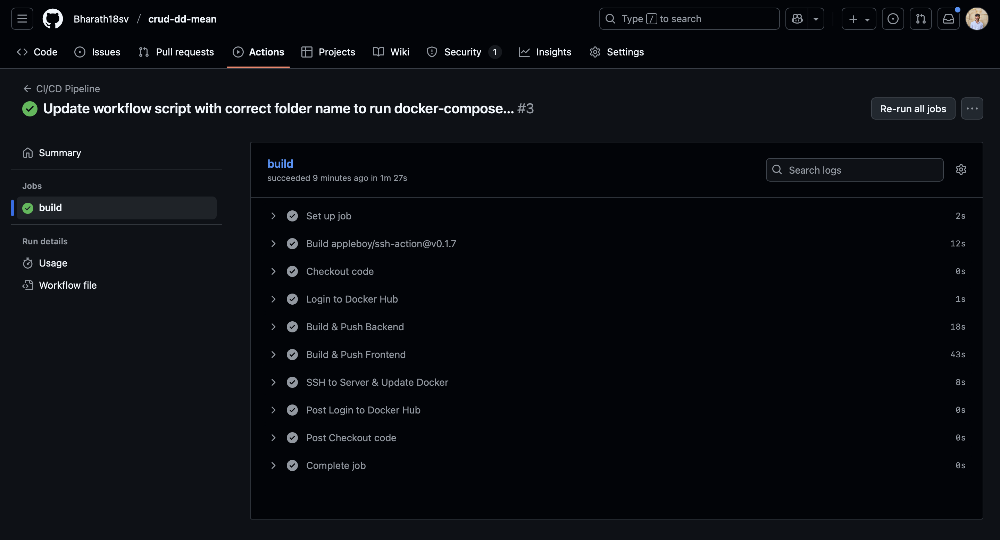
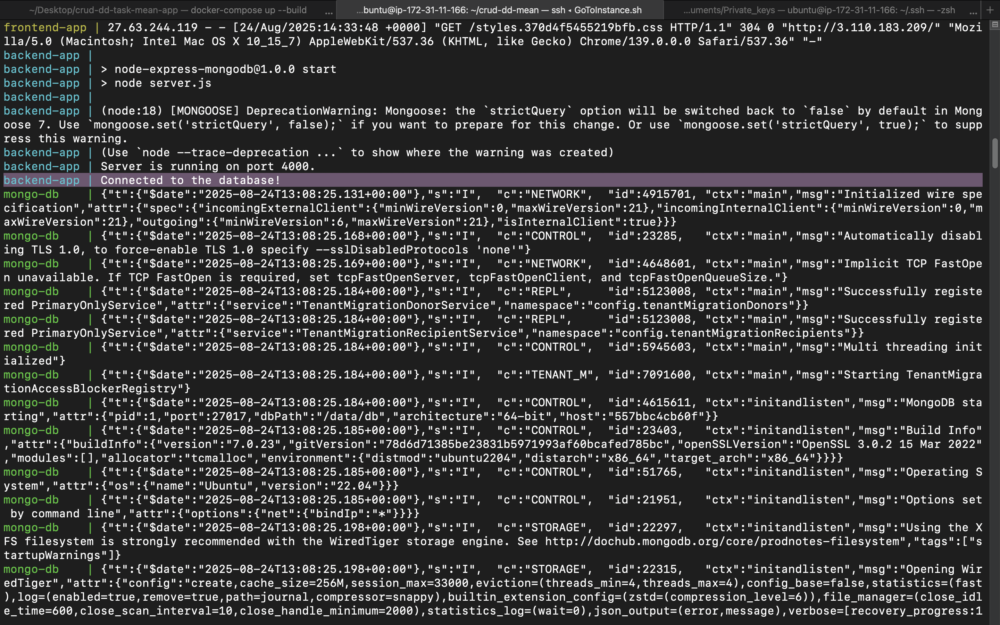
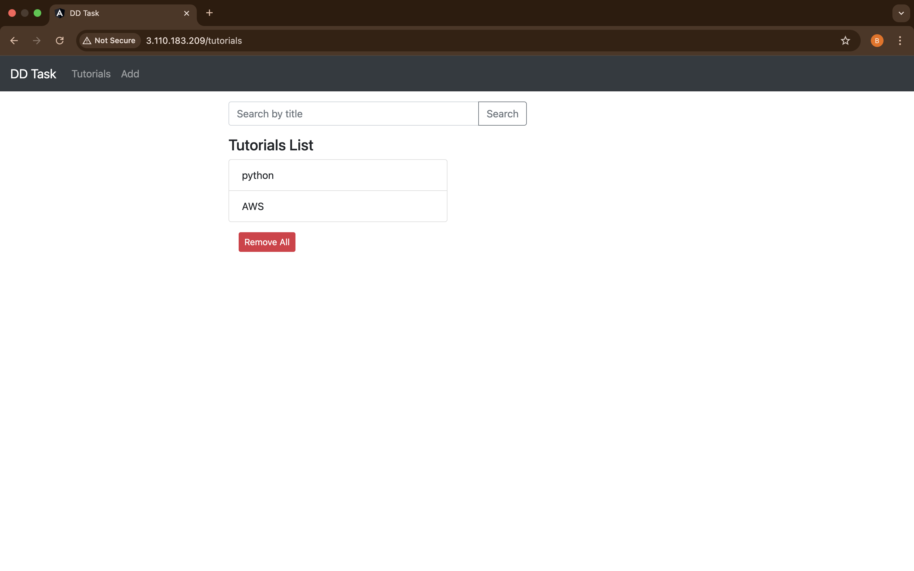
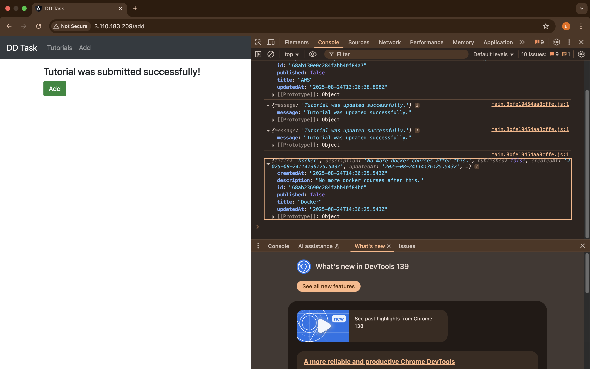

# MEAN Stack CRUD Application – Dockerized & CI/CD Enabled

This repository contains a **full-stack MEAN (MongoDB, Express, Angular, Node.js) CRUD application** with complete **Dockerization** and **CI/CD workflow using GitHub Actions**. The application allows users to manage a collection of tutorials (create, read, update, delete, and search).

The repository includes:

- `backend/` → Node.js & Express REST API
- `frontend/` → Angular 15 frontend
- `docker-compose.yml` → Multi-container orchestration
- `.github/workflows/ci-cd-pipeline.yml` → CI/CD workflow
- Dockerfiles for frontend and backend

## Table of Contents

1. [Prerequisites](#prerequisites)
2. [Setup & Deployment Instructions](#setup--deployment-instructions)
   - [Local Development](#local-development)
   - [VM / Cloud Deployment](#vm--cloud-deployment-aws-ec2-example)
3. [Docker & Docker Compose](#docker--docker-compose)
4. [CI/CD Workflow](#cicd-workflow-github-actions)
5. [Application Screenshots](#application-screenshots)
6. [Nginx Setup & Infrastructure](#nginx-setup--infrastructure)

## Prerequisites

- Docker & Docker Compose installed
- Node.js & npm (optional, for local testing)
- Git & GitHub account
- Ubuntu VM (e.g., AWS EC2) with SSH access

## Setup & Deployment Instructions

### Local Development

1. **Clone the repository:**
   ```bash
   git clone https://github.com/<your-username>/crud-dd-task-mean-app.git
   cd crud-dd-task-mean-app
   ```

2. **Build and run containers locally:**
   ```bash
   docker-compose up --build -d
   ```

3. **Check running containers:**
   ```bash
   docker ps
   ```
   - `mongo-db` → MongoDB (port 27017)
   - `backend-app` → Node.js backend (port 4000)
   - `frontend-app` → Angular frontend served via Nginx (port 80)

4. **Access application:**
   - Frontend: http://localhost
   - Backend API: http://localhost:4000/api/tutorials

### VM / Cloud Deployment (AWS EC2 example)

1. **SSH into VM:**
   ```bash
   ssh -i <your-private-key.pem> ubuntu@<EC2-public-IP>
   ```

2. **Pull repository on VM:**
   ```bash
   git clone https://github.com/<your-username>/crud-dd-task-mean-app.git
   cd crud-dd-task-mean-app
   ```

3. **Run Docker Compose:**
   ```bash
   docker-compose up --build -d
   ```

4. **Open browser:**
   - Frontend: http://\<EC2-public-IP\>
   - Backend API: http://\<EC2-public-IP\>:4000/api/tutorials

5. **Verify logs:**
   ```bash
   docker-compose logs -f backend
   docker-compose logs -f frontend
   docker-compose logs -f mongo
   ```

## Docker & Docker Compose

### Backend Dockerfile (backend/Dockerfile)

```dockerfile
FROM node:20-alpine
WORKDIR /app
COPY package*.json ./
RUN npm install
COPY . .
EXPOSE 4000
CMD ["npm", "start"]
```

### Frontend Dockerfile (frontend/Dockerfile)

```dockerfile
# Stage 1: Build Angular app
FROM node:20-alpine AS build
WORKDIR /app
COPY package*.json ./
RUN npm install
COPY . .
RUN npm run build --prod

# Stage 2: Serve with Nginx
FROM nginx:alpine
COPY --from=build /app/dist/<angular-app-folder> /usr/share/nginx/html
EXPOSE 80
CMD ["nginx", "-g", "daemon off;"]
```

### Docker Compose (docker-compose.yml)

```yaml
version: "3.9"
services:
  mongo:
    image: mongo:7.0
    container_name: mongo-db
    ports:
      - "27017:27017"
    volumes:
      - mongo_data:/data/db
  backend:
    build: ./backend
    container_name: backend-app
    ports:
      - "4000:4000"
    environment:
      MONGO_URI: mongodb://mongo:27017/mean_project
    depends_on:
      - mongo
  frontend:
    build: ./frontend
    container_name: frontend-app
    ports:
      - "80:80"
    depends_on:
      - backend
volumes:
  mongo_data:
```

## CI/CD Workflow (GitHub Actions)

**Trigger:** Push to main branch

**Steps:**
1. Checkout code
2. Login to Docker Hub
3. Build & push backend and frontend images
4. SSH into VM and run `docker-compose pull && docker-compose up -d`

### Workflow file: `.github/workflows/ci-cd-pipeline.yml`

```yaml
name: CI/CD Pipeline

on:
  push:
    branches:
      - main

jobs:
  build:
    runs-on: ubuntu-latest
    steps:
      - name: Checkout code
        uses: actions/checkout@v3
      
      - name: Login to Docker Hub
        uses: docker/login-action@v2
        with:
          username: ${{ secrets.DOCKER_HUB_USERNAME }}
          password: ${{ secrets.DOCKER_HUB_ACCESS_TOKEN }}
      
      - name: Build & Push Backend
        run: |
          docker build -t <dockerhub-username>/backend-crud-app:latest ./backend
          docker push <dockerhub-username>/backend-crud-app:latest
      
      - name: Build & Push Frontend
        run: |
          docker build -t <dockerhub-username>/frontend-crud-app:latest ./frontend
          docker push <dockerhub-username>/frontend-crud-app:latest
      
      - name: SSH to Server & Deploy
        uses: appleboy/ssh-action@v0.1.7
        with:
          host: ${{ secrets.VM_IP }}
          username: ubuntu
          key: ${{ secrets.VM_SSH_KEY }}
          script: |
            cd /home/ubuntu/crud-dd-task-mean-app
            docker-compose pull
            docker-compose up -d
```

### Application Screenshots

### CI/CD Execution on GitHub Actions



### Docker Image Build & Push Logs



### Frontend UI Running on VM



### Backend API Response in Browser/Postman



## Nginx Setup & Infrastructure

- Frontend served via Nginx inside the container
- Port 80 mapped to host for public access
- Backend container communicates with MongoDB container internally
- Docker Compose ensures **multi-container orchestration**, **automatic network setup**, and volume persistence for MongoDB

## Repository Link

[GitHub Repository](https://github.com/Bharath18sv/crud-dd-mean)